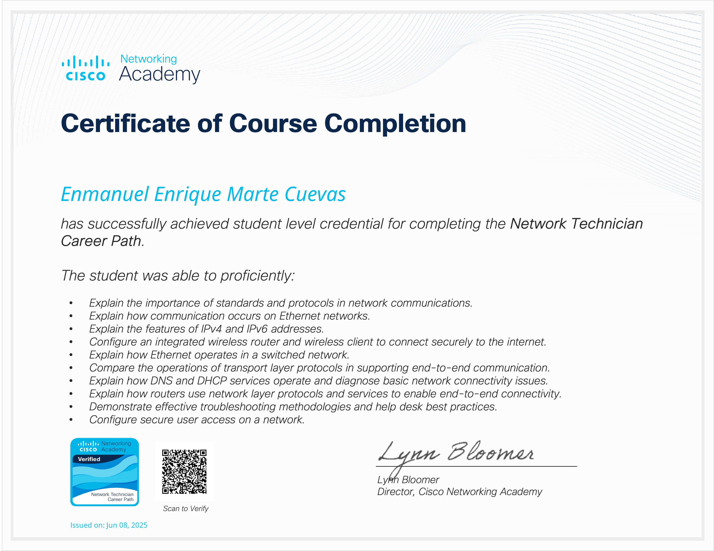

<h1><b>Hi, I'm Enmanuel Marte</b> </h1>

 
Cybersecurity & Cloud Student | Passionate about building and securing real-world infrastructures — from SIEM environments to enterprise networks — while developing solid backend skills. Constantly pushing myself to understand systems deeper, break them safely, and build them stronger.

---

## Skills:

**Cybersecurity & OS:**

**Networking & Firewalls:**

`FortiGate · VPN IPsec · VLANs · ACLs · NAT/PAT · STP · EtherChannel · VRRP · GNS3 · Wazuh · Zabbix`

**Cloud & DevOps:**

**Databases:**

**Programming & Scripting:**

## Certificados

   
   
   

## Contacts

  
  &nbsp;&nbsp;&nbsp;
  
  &nbsp;&nbsp;&nbsp;
  

